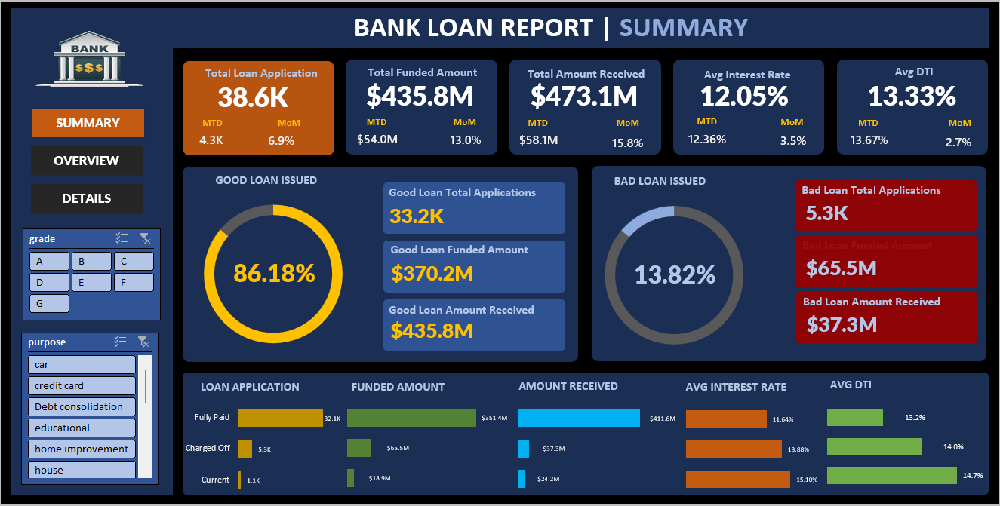
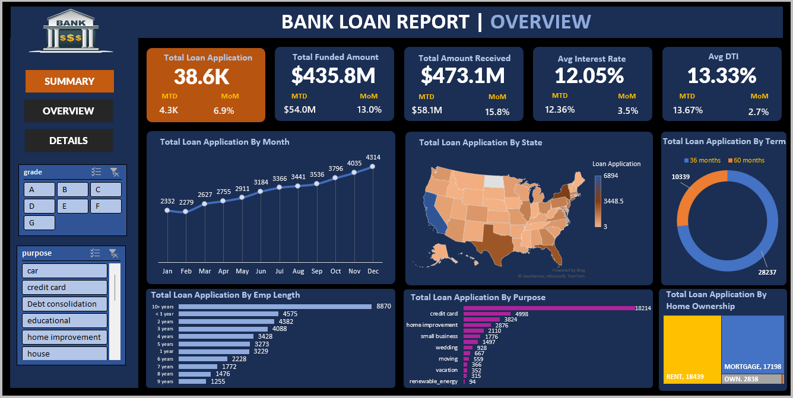

# 🏦 Bank Loan Analysis – Excel Dashboard

## 📌 Project Overview
The **Bank Loan Analysis Dashboard** is an Excel-based data analytics project designed to monitor, analyze, and evaluate a bank’s loan portfolio performance.  
This project helps stakeholders track key lending metrics, assess loan quality, and identify trends to support **data-driven decision-making**.

---

## 🎯 Problem Statement
Banks require a centralized reporting system to monitor lending activities, understand portfolio health, and distinguish between **Good Loans** and **Bad Loans**.  
This dashboard provides a comprehensive view of loan performance using KPIs and interactive visualizations.

---

## 📊 Key Performance Indicators (KPIs)
- Total Loan Applications  
- Total Funded Amount  
- Total Amount Received  
- Average Interest Rate  
- Average Debt-to-Income Ratio (DTI)  
- Month-to-Date (MTD) Metrics  
- Month-over-Month (MoM) Growth  

---

## ✅ Good Loan vs Bad Loan Analysis

### 🟢 Good Loans
- Loan Status: **Fully Paid**, **Current**
- KPIs:
  - Good Loan Application Percentage
  - Good Loan Applications
  - Good Loan Funded Amount
  - Good Loan Amount Received

### 🔴 Bad Loans
- Loan Status: **Charged Off**
- KPIs:
  - Bad Loan Application Percentage
  - Bad Loan Applications
  - Bad Loan Funded Amount
  - Bad Loan Amount Received

---

## 📈 Dashboards

### 1️⃣ Summary Dashboard
- Overall loan KPIs
- Good vs Bad loan comparison
- Loan status performance
- Average Interest Rate & DTI analysis

📸 Screenshot:  


---

### 2️⃣ Overview Dashboard
- Monthly loan application trends
- State-wise loan distribution (Map)
- Loan term analysis (36 & 60 months)
- Employment length analysis
- Loan purpose breakdown
- Home ownership analysis

📸 Screenshot:  


---

## 🗂 Dataset
The dataset includes historical bank loan data with:
- Loan amount
- Issue date
- Interest rate
- DTI
- Loan status
- Purpose
- Employment length
- Home ownership
- State

---

## 🛠 Tools & Technologies
- Microsoft Excel
- Pivot Tables & Pivot Charts
- Power Query
- Excel Formulas
- Slicers & Filters
- Conditional Formatting

---

## 📁 Repository Structure
```
Bank-Loan-Analysis-Excel-Dashboard
│
├── dashboard/                           # Final Excel dashboard file
│   └── bank_loan_analysis_dashboard.xlsx
│
├── dataset/                             # Raw and cleaned dataset used for analysis
│   └── dataset.xlsx                        
│
├── design/                              # Dashboard planning and design sheet
│   └── design_sheet.xlsx                         
│
├── documentation/                       # Project documentation and business understanding
│   ├── domain_knowledge.docx            # Banking & loan domain concepts
│   ├── problem_statement.docx           # Business problem and KPI requirements
│   ├── sql_query.docx                   # Logic, calculations, and Excel formulas
│   └── terminologies.docx               # Key data and banking terminologies
│
├── screenshots/                         # Dashboard preview images
│   ├── summary_dashboard.png            # Summary dashboard screenshot
│   └── overview_dashboard.png           # Overview dashboard screenshot
│
├── LICENSE                              # License information for the repository
└── README.md                            # Project overview and instructions
                 
```


---

## 🔍 Key Insights
- Majority of loans fall under the **Good Loan** category  
- Certain states contribute significantly to loan volume  
- Borrowers with longer employment tenure show higher loan applications  
- Debt consolidation and credit card loans are the most common purposes  
- Charged-off loans represent a smaller but critical risk segment  

---

## 🚀 Conclusion
This Excel dashboard provides a powerful overview of bank loan performance, enabling financial institutions to monitor risk, improve lending strategies, and make informed decisions.

---

## 👤 Author
**Tushar Borkar**  
Aspiring Data Analyst | Excel | Power BI | SQL | Python  

---

⭐ *If you find this project useful, please give it a star!*
